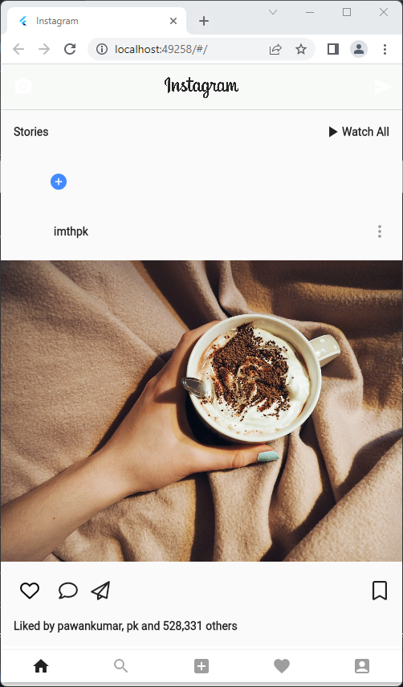

# instagram_clone

Flutterで開発した簡易版InstagramのUI。

# 完成画像



# 完成ファイル

## `main.dart`

```dart
import 'package:flutter/material.dart';
import 'package:instagram_clone/insta_home.dart';

void main() => runApp(new MyApp());

class MyApp extends StatelessWidget {
  // This widget is the root of your application.
  @override
  Widget build(BuildContext context) {
    return new MaterialApp(
      title: 'Instagram',
      debugShowCheckedModeBanner: false,
      theme: new ThemeData(
          primarySwatch: Colors.blue,
          primaryColor: Colors.black,
          buttonColor: Colors.black,
          primaryIconTheme: IconThemeData(color: Colors.black),
          primaryTextTheme: TextTheme(
              bodyText1: TextStyle(color: Colors.black, fontFamily: "Aveny")),
          textTheme: TextTheme(bodyText1: TextStyle(color: Colors.black))),
      home: new InstaHome(),
    );
  }
}
```

## `insta_home.dart`

```dart
import 'package:flutter/material.dart';
import 'package:instagram_clone/insta_body.dart';

class InstaHome extends StatelessWidget {
  final topBar = new AppBar(
    backgroundColor: new Color(0xfff8faf8),
    centerTitle: true,
    elevation: 1.0,
    leading: new Icon(Icons.camera_alt),
    title: SizedBox(
        height: 35.0, child: Image(image: AssetImage('insta_logo.png'))),
    actions: <Widget>[
      Padding(
        padding: const EdgeInsets.only(right: 12.0),
        child: Icon(Icons.send),
      )
    ],
  );

  @override
  Widget build(BuildContext context) {
    return new Scaffold(
        appBar: topBar,
        body: new InstaBody(),
        bottomNavigationBar: new Container(
          color: Colors.white,
          height: 50.0,
          alignment: Alignment.center,
          child: new BottomAppBar(
            child: new Row(
              // alignment: MainAxisAlignment.spaceAround,
              mainAxisAlignment: MainAxisAlignment.spaceAround,
              children: <Widget>[
                new IconButton(
                  icon: Icon(
                    Icons.home,
                  ),
                  onPressed: () {},
                ),
                new IconButton(
                  icon: Icon(
                    Icons.search,
                  ),
                  onPressed: null,
                ),
                new IconButton(
                  icon: Icon(
                    Icons.add_box,
                  ),
                  onPressed: null,
                ),
                new IconButton(
                  icon: Icon(
                    Icons.favorite,
                  ),
                  onPressed: null,
                ),
                new IconButton(
                  icon: Icon(
                    Icons.account_box,
                  ),
                  onPressed: null,
                ),
              ],
            ),
          ),
        ));
  }
}
```

## `insta_body.dart`

```dart
import 'package:flutter/material.dart';
import 'package:instagram_clone/insta_list.dart';

class InstaBody extends StatelessWidget {
  @override
  Widget build(BuildContext context) {
    return new Column(
      mainAxisAlignment: MainAxisAlignment.start,
      children: <Widget>[
        // Expanded(flex: 1, child: new InstaStories()),
        Flexible(child: InstaList())
      ],
    );
  }
}
```

## `insta_list.dart`

```dart
import 'package:flutter/material.dart';
import 'package:font_awesome_flutter/font_awesome_flutter.dart';
import 'package:instagram_clone/insta_stories.dart';

class InstaList extends StatefulWidget {
  @override
  _InstaListState createState() => _InstaListState();
}

class _InstaListState extends State<InstaList> {
  bool isPressed = false;

  @override
  Widget build(BuildContext context) {
    var deviceSize = MediaQuery.of(context).size;
    return ListView.builder(
      itemCount: 5,
      itemBuilder: (context, index) => index == 0
          ? new SizedBox(
              child: new InstaStories(),
              height: deviceSize.height * 0.15,
            )
          : Column(
              mainAxisAlignment: MainAxisAlignment.start,
              mainAxisSize: MainAxisSize.min,
              crossAxisAlignment: CrossAxisAlignment.stretch,
              children: <Widget>[
                Padding(
                  padding: const EdgeInsets.fromLTRB(16.0, 16.0, 8.0, 16.0),
                  child: Row(
                    mainAxisAlignment: MainAxisAlignment.spaceBetween,
                    children: <Widget>[
                      Row(
                        children: <Widget>[
                          new Container(
                            height: 40.0,
                            width: 40.0,
                            decoration: new BoxDecoration(
                              shape: BoxShape.circle,
                              image: new DecorationImage(
                                  fit: BoxFit.fill,
                                  image: AssetImage('profile.jpeg')),
                            ),
                          ),
                          new SizedBox(
                            width: 10.0,
                          ),
                          new Text(
                            "imthpk",
                            style: TextStyle(fontWeight: FontWeight.bold),
                          )
                        ],
                      ),
                      new IconButton(
                        icon: Icon(Icons.more_vert),
                        onPressed: null,
                      )
                    ],
                  ),
                ),
                Flexible(
                  fit: FlexFit.loose,
                  child: new Image.network(
                    "https://images.pexels.com/photos/672657/pexels-photo-672657.jpeg?auto=compress&cs=tinysrgb&dpr=2&h=750&w=1260",
                    fit: BoxFit.cover,
                  ),
                ),
                Padding(
                  padding: const EdgeInsets.all(16.0),
                  child: Row(
                    mainAxisAlignment: MainAxisAlignment.spaceBetween,
                    children: <Widget>[
                      new Row(
                        mainAxisAlignment: MainAxisAlignment.spaceBetween,
                        children: <Widget>[
                          new IconButton(
                            icon: new Icon(isPressed
                                ? Icons.favorite
                                : FontAwesomeIcons.heart),
                            color: isPressed ? Colors.red : Colors.black,
                            onPressed: () {
                              setState(() {
                                isPressed = !isPressed;
                              });
                            },
                          ),
                          new SizedBox(
                            width: 16.0,
                          ),
                          new Icon(
                            FontAwesomeIcons.comment,
                          ),
                          new SizedBox(
                            width: 16.0,
                          ),
                          new Icon(FontAwesomeIcons.paperPlane),
                        ],
                      ),
                      new Icon(FontAwesomeIcons.bookmark)
                    ],
                  ),
                ),
                Padding(
                  padding: const EdgeInsets.symmetric(horizontal: 16.0),
                  child: Text(
                    "Liked by pawankumar, pk and 528,331 others",
                    style: TextStyle(fontWeight: FontWeight.bold),
                  ),
                ),
                Padding(
                  padding: const EdgeInsets.fromLTRB(16.0, 16.0, 0.0, 8.0),
                  child: Row(
                    mainAxisAlignment: MainAxisAlignment.start,
                    children: <Widget>[
                      new Container(
                        height: 40.0,
                        width: 40.0,
                        decoration: new BoxDecoration(
                          shape: BoxShape.circle,
                          image: new DecorationImage(
                              fit: BoxFit.fill,
                              image: new NetworkImage(
                                  "https://pbs.twimg.com/profile_images/916384996092448768/PF1TSFOE_400x400.jpg")),
                        ),
                      ),
                      new SizedBox(
                        width: 10.0,
                      ),
                      Expanded(
                        child: new TextField(
                          decoration: new InputDecoration(
                            border: InputBorder.none,
                            hintText: "Add a comment...",
                          ),
                        ),
                      ),
                    ],
                  ),
                ),
                Padding(
                  padding: const EdgeInsets.symmetric(horizontal: 16.0),
                  child:
                      Text("1 Day Ago", style: TextStyle(color: Colors.grey)),
                )
              ],
            ),
    );
  }
}
```

## `insta_stories.dart`

```dart
import 'package:flutter/material.dart';

class InstaStories extends StatelessWidget {
  final topText = Row(
    mainAxisAlignment: MainAxisAlignment.spaceBetween,
    children: <Widget>[
      Text(
        "Stories",
        style: TextStyle(fontWeight: FontWeight.bold),
      ),
      new Row(
        children: <Widget>[
          new Icon(Icons.play_arrow),
          new Text("Watch All", style: TextStyle(fontWeight: FontWeight.bold))
        ],
      )
    ],
  );

  final stories = Expanded(
    child: new Padding(
      padding: const EdgeInsets.only(top: 8.0),
      child: new ListView.builder(
        scrollDirection: Axis.horizontal,
        itemCount: 5,
        itemBuilder: (context, index) => new Stack(
          alignment: Alignment.bottomRight,
          children: <Widget>[
            new Container(
              width: 60.0,
              height: 60.0,
              decoration: new BoxDecoration(
                shape: BoxShape.circle,
                image: new DecorationImage(
                    fit: BoxFit.fill,
                    image: new NetworkImage(
                        "https://pbs.twimg.com/profile_images/916384996092448768/PF1TSFOE_400x400.jpg")),
              ),
              margin: const EdgeInsets.symmetric(horizontal: 8.0),
            ),
            index == 0
                ? Positioned(
                    right: 10.0,
                    child: new CircleAvatar(
                      backgroundColor: Colors.blueAccent,
                      radius: 10.0,
                      child: new Icon(
                        Icons.add,
                        size: 14.0,
                        color: Colors.white,
                      ),
                    ))
                : new Container()
          ],
        ),
      ),
    ),
  );

  @override
  Widget build(BuildContext context) {
    return new Container(
      margin: const EdgeInsets.all(16.0),
      child: new Column(
        crossAxisAlignment: CrossAxisAlignment.stretch,
        mainAxisAlignment: MainAxisAlignment.start,
        mainAxisSize: MainAxisSize.min,
        children: <Widget>[
          topText,
          stories,
        ],
      ),
    );
  }
}
```

# 開発環境

* Flutter 3
* Windows 11
* Visual Studio Code 1.68